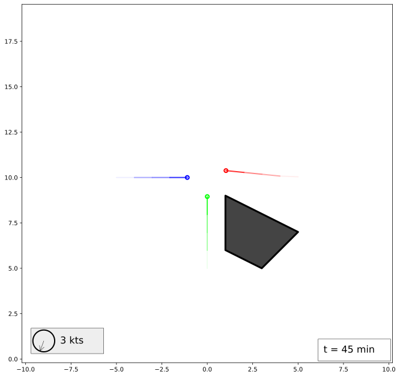
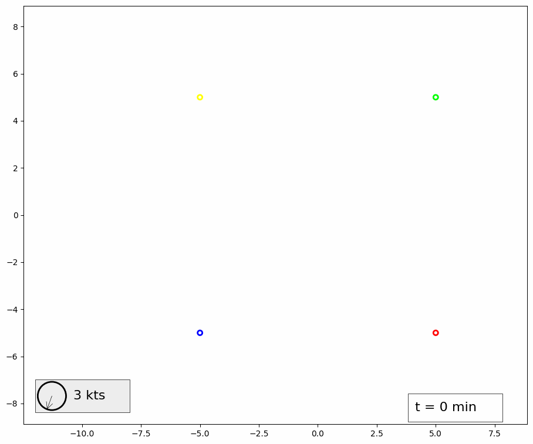

# Sequence visualizer

This program generates frame-by-frame visualization of sequences. It was originally developed for visualizing sequences of ship positions.

## Example

An example of one generated frame is shown below. [Here](https://raw.githubusercontent.com/GertKanter/sequence_visualizer/develop/samples/three.json) is the JSON that was used to generate it (this is frame 9).



A sequence generated from [four](https://raw.githubusercontent.com/GertKanter/sequence_visualizer/develop/samples/four.json) sequences is shown below.



## How to use

Clone this repository and build using cargo tool.

```
cargo build
```

Then run the built executable

```
sequence_visualizer --help
Visualization of multiple timed sequences

Usage: sequence_visualizer [OPTIONS]

Options:
  -c, --csv-file <CSV_FILE>    Data file in CSV format [default: ]
  -j, --json-file <JSON_FILE>  Data file in JSON format [default: ]
  -o, --output-png             Save output as PNG files
  -h, --help                   Print help
  -V, --version                Print version
```

You can use the example data for testing

```
sequence_visualizer -j samples/three.json
Parsing JSON file samples/three.json...
Plotting scene...
Scene bounds [-10, 0, 10, 19.34]
Writing file result0.svg...
Writing file result1.svg...
Writing file result2.svg...
Writing file result3.svg...
Writing file result4.svg...
Writing file result5.svg...
Writing file result6.svg...
Writing file result7.svg...
Writing file result8.svg...
Writing file result9.svg...
Writing file result10.svg...
Writing file result11.svg...
Writing file result12.svg...
Writing file result13.svg...
Writing file result14.svg...
Writing file result15.svg...
Writing file result16.svg...
Writing file result17.svg...
Writing file result18.svg...
Writing file result19.svg...
Writing file result20.svg...
Done!
```
